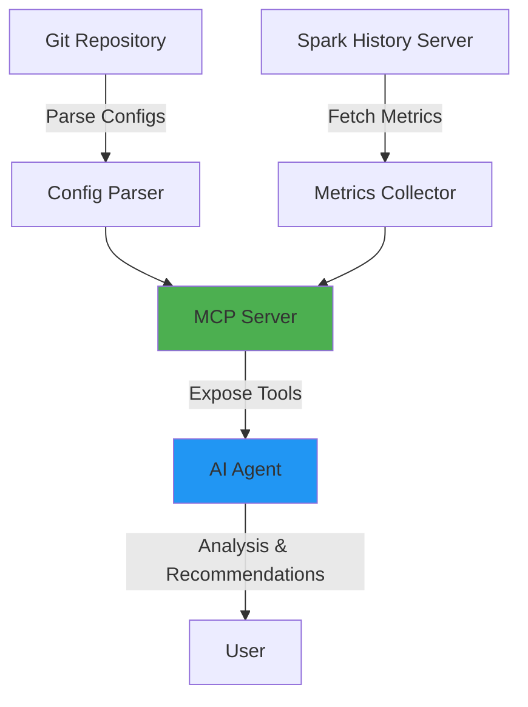

# Agent-Based Spark Configuration Evaluation System

## Overview

This hackathon project creates an intelligent system that:
- Parses Spark configuration files from Git repositories
- Connects to Spark History Server for real-time execution metrics
- Uses AI agents to analyze configurations and correlate them with performance data
- Generates actionable recommendations for optimization

The system is built as an **MCP (Model Context Protocol) server** that exposes tools for AI agents to interact with Spark configurations and metrics.

## Architecture



## User Review Required

> [!IMPORTANT]
> **Technology Stack Decision**
> - Using **Python** for the MCP server
> - Using **OpenAI API (GPT-4o)** for AI-powered analysis
> - Using **Spark History Server REST API** for metrics
> - For hackathon demo: Includes mock History Server data for standalone execution

## Proposed Changes

### Core System Components

#### [MODIFY] [spark_config_parser.py](file:///home/armel/Desktop/agent-spark/spark_config_mcp/spark_config_parser.py)

Configuration parser that extracts Spark settings from multiple sources:
- Parse `spark-defaults.conf` files (key=value format)
- Parse `spark-submit` scripts (extract --conf flags and resource settings)
- Handle multi-line commands with backslash continuations
- Return structured configuration objects

#### [MODIFY] [history_server_client.py](file:///home/armel/Desktop/agent-spark/spark_config_mcp/history_server_client.py)

Client for Spark History Server REST API:
- Connect to History Server endpoint
- Fetch application list and details
- Retrieve execution metrics (duration, stages, tasks, memory usage)
- Included mock data mode for standalone demo

#### [MODIFY] [config_analyzer.py](file:///home/armel/Desktop/agent-spark/spark_config_mcp/config_analyzer.py)

AI-powered analysis engine:
- Correlate configurations with execution metrics
- Identify inefficiencies and anti-patterns
- Generate specific recommendations
- Use **OpenAI API** for intelligent analysis
- Provide severity ratings (critical, warning, info)

---

### MCP Server Implementation

#### [MODIFY] [server.py](file:///home/armel/Desktop/agent-spark/spark_config_mcp/server.py)

Implement MCP server with the following tools:

**Tool 1: `parse_spark_config`**
- Input: Git repository path or file path
- Parses all Spark config files in the repository

**Tool 2: `fetch_app_metrics`**
- Input: Application ID or name pattern
- Supports both real and mock data

**Tool 3: `analyze_configuration`**
- Input: Configuration data + execution metrics
- Uses OpenAI to provide intelligent insights

**Tool 4: `get_recommendations`**
- Input: Analysis results
- Categorized by: resource allocation, performance tuning, best practices

---

### Configuration & Documentation

#### [MODIFY] [requirements.txt](file:///home/armel/Desktop/agent-spark/requirements.txt)

Python dependencies:
- `mcp` - Model Context Protocol
- `openai` - OpenAI API Client
- `requests` - HTTP client for History Server

#### [MODIFY] [.env.example](file:///home/armel/Desktop/agent-spark/.env.example)

Environment variables template:
- `OPENAI_API_KEY` - OpenAI API key
- `SPARK_HISTORY_SERVER_URL` - History Server endpoint
- `USE_MOCK_DATA` - Enable demo mode

## Verification Plan

### Automated Tests

```bash
# Install dependencies
pip install -r requirements.txt

# Run the standalone demo
python demo_agent.py
```

### Demo Workflow

1. **Parse Configuration**: Reads `demo_repo/deploy_job.sh`
2. **Fetch Metrics**: Retrieve mock/real execution data
3. **Analyze**: AI identifies issues (oversized driver memory, inefficient settings)
4. **Recommend**: Generate specific optimization suggestions
